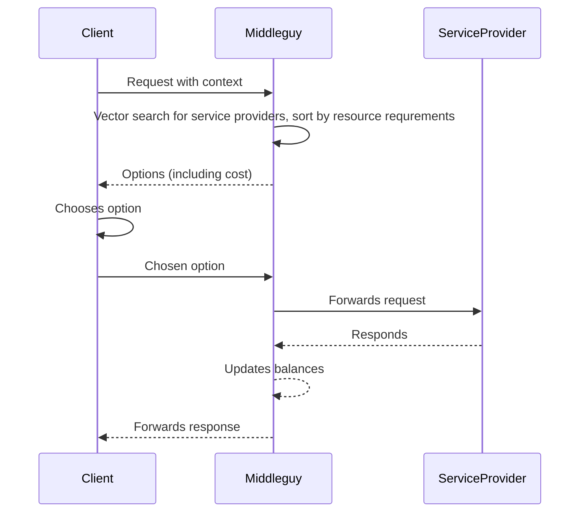

Middleguy
===

```mermaid
sequenceDiagram
    participant Client
    participant Middleguy
    participant ServiceProvider

    Client->>Middleguy: Request with context
    Middleguy->>Middleguy: Vector search for service providers, sort by resource requrements
    Middleguy-->>Client: Options (including cost)
    Client->>Client: Chooses option 
    Client->>Middleguy: Chosen option
    Middleguy->>ServiceProvider: Forwards request
    ServiceProvider-->>Middleguy: Responds
    Middleguy-->>Middleguy: Updates balances
    Middleguy-->>Client: Forwards response

```

Context example: 

```mermaid
sequenceDiagram
    participant Client
    participant Middleguy
    participant ServiceProvider

    Client->>Middleguy: Request with context
    Middleguy->>Middleguy: Vector search for service providers, sort by resource requrements
    Middleguy-->>Client: Options (including cost)
    Client->>Client: Chooses option 
    Client->>Middleguy: Chosen option
    Middleguy->>ServiceProvider: Forwards request
    ServiceProvider-->>Middleguy: Responds
    Middleguy-->>Middleguy: Updates balances
    Middleguy-->>Client: Forwards response

```
